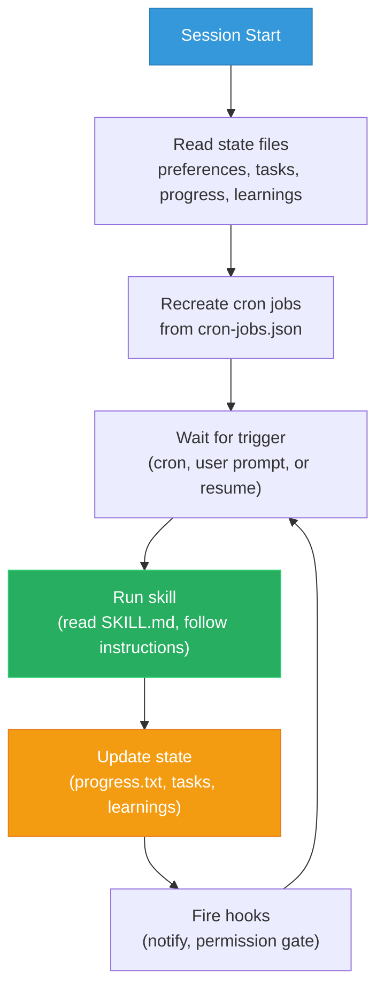

# Architecture

This repo is a forkable template for building an autonomous developer agent with [Claude Code](https://claude.ai/claude-code). Everything is file-based -- no database, no cloud service beyond the APIs your skills call. The agent reads markdown instructions, maintains state in plain files, and runs skills on cron schedules. Git is the audit trail.

## The Autonomy Loop

Every agent action follows one cycle: read state, decide, act, update state.



## Files Reference

| File | What | Why | How |
|------|------|-----|-----|
| `CLAUDE.md` | Master instruction set | Single source of truth for agent behavior | Read at session start + after compaction |
| `preferences.md` | User identity, style, don'ts | Personalizes the agent to you | Edit manually; agent appends corrections |
| `tasks-active.md` | Current work items | Agent knows what to work on | Agent adds/removes; you edit priorities |
| `tasks-completed.md` | Done items archive | Context for standups and daily reviews | Append-only; tasks move here when done |
| `progress.txt` | Action log | Audit trail of everything the agent did | Append-only; both you and agent write |
| `error-log.md` | Past mistakes | Agent reads at startup to avoid repeating | Agent appends inline when corrected |
| `learnings.md` | Patterns, mistakes, preferences | Compound improvement over time | Agent appends inline; learning-loop consolidates |
| `priority-map.md` | P0-P3 priority definitions | Agent ranks work consistently | Edit manually to match your workflow |
| `cron-jobs.json` | Scheduled skill definitions | Skills run on autopilot | Edit to add/remove/reschedule skills |

## Hooks

Hooks are shell scripts that fire automatically on Claude Code events. Exit codes control behavior: **0** = continue, **1** = warn, **2** = block the operation.

This repo includes two hooks:

- **`stop-telegram.sh`** -- Fires on `Stop` (agent finishes a response). Sends a Telegram message with the last output. Requires `TELEGRAM_BOT_TOKEN` and `TELEGRAM_CHAT_ID` env vars. Exits 0 (never blocks).

- **`permission-gate.sh`** -- Fires on `PreToolUse` (before any tool call). Blocks force pushes to main/master and recursive deletes from root (exit 2). Everything else passes (exit 0).

Hooks are registered in `.claude/settings.json` (included in this repo). To enable Telegram notifications, set the `TELEGRAM_BOT_TOKEN` and `TELEGRAM_CHAT_ID` environment variables.

## Permissions

The `settings.json` includes a permissions allowlist for safe operations — read-only tools and git read commands run without prompting. Force pushes and destructive deletes are explicitly denied.

Once you trust the agent after running it for a while, you can switch to `bypassPermissions` mode to skip all prompts:

```bash
claude --permission-mode bypassPermissions
```

Writes to `.git` and `.claude` still prompt even in bypass mode (safety net). Start with the default allowlist, expand it as you build trust.

## Skills

Every skill is a `SKILL.md` file with four sections:

1. **Input** -- what files to read before acting
2. **Process** -- step-by-step instructions
3. **Output** -- what to produce
4. **State Update** -- what files to update when done

Skills communicate through shared state files, not by calling each other directly. The git reviewer writes to progress.txt; the standup generator reads it the next morning.

| Skill | Schedule | What It Does |
|-------|----------|-------------|
| `daily-planner` | 5:33 PM | Reviews tasks, scores the day 1-10, plans tomorrow |
| `pr-reviewer` | 9 AM, 1 PM, 5 PM | Queries open PRs via `gh`, flags size/security/staleness risks |
| `git-reviewer` | Noon | Summarizes commits with WHAT/WHY/IMPACT analysis |
| `standup-generator` | 8:30 AM weekdays | Composes a ready-to-paste standup from agent data |
| `meeting-ingest` | 6:37 PM | Extracts action items and decisions from meeting transcripts |
| `learning-loop` | 11:47 PM | Consolidates daily corrections, promotes repeated patterns |
| `heartbeat` | Every 2h | Checks cron health, state validity, task deadlines, failures |
| `skill-evaluator` | 3:03 AM daily | Scores all skills on 5 dimensions, recommends improvements |
| `task-triage` | Sunday 8 AM | Prunes task list, archives stale items, targets under 30 |
| `topic-discovery` | Wednesday 10:03 AM | Feeds content pipeline with new ideas from trends and gaps |
| `log-monitor` | Weekdays 7:03 AM | Checks Azure workspace logs for exceptions and anomalies |
| `youtube-to-blog` | On-demand | Converts YouTube transcript (via Gemini) into English blog article |
| `link-checker` | On-demand | Researches links, cross-validates findings with tiered depth |
| `course-updater` | On-demand | Applies approved updates to course repo, blog, and landing page |

## Scheduling

Cron jobs are defined in `cron-jobs.json`. Each entry has a name, cron expression, skill reference, and status.

Cron jobs expire after 7 days. If your agent restarts after a gap, stale jobs do not pile up. The heartbeat skill runs every 2 hours and recreates any expired crons via CronCreate.

At session startup, the agent reads `cron-jobs.json` and recreates all active jobs. Config in JSON is not activation -- the agent must create the actual cron jobs.

## Self-Healing

The heartbeat skill is the safety net. Every 2 hours it checks:
- Are all cron jobs alive and within expiry?
- Is progress.txt fresh (updated in the last 24h)?
- Are there overdue or stale tasks?
- Are there unresolved entries in failed-jobs.log?
- Can all state files be parsed?
- Do all referenced SKILL.md files exist?

If something is wrong, the heartbeat can autonomously recreate expired crons (via CronCreate — expired jobs are deleted, not paused), retry failed jobs (once), and re-read critical files. It cannot delete files, modify skill logic, or push code -- those require human approval.

## Adding a New Skill

Tell Claude Code what you need:

```
Create a new skill called "{name}" that {description}.
It should run {schedule}. Follow the same SKILL.md pattern
as the existing skills (Input, Process, Output, State Update).
Add it to cron-jobs.json and register it with the heartbeat.
```

Claude Code will create the skill file, update the cron config, and add it to the heartbeat's verification list. Test it manually first ("Run the {name} skill"), then monitor `progress.txt` and `failed-jobs.log` for the first few scheduled runs.

## Skill Design Patterns

These patterns emerged from running 14+ skills in production. Apply them when building new skills or hardening existing ones.

### Step 0: Capability Pre-Check

Before a skill does any real work, verify that its external dependencies are available. This is the universal pattern for any skill that calls tools outside the local filesystem.

```markdown
### Step 0: Capability Pre-Check
- Verify `az account show` succeeds (log-monitor)
- Verify Chrome is reachable (browser-verify)
- Verify WebSearch returns results (link-checker, topic-discovery)
- If any check fails: log to failed-jobs.log with the specific
  dependency that failed, and exit without running the skill.
```

Why this matters: without a pre-check, the skill runs its full process, fails halfway through, and produces a partial or misleading result. The pre-check fails fast with a clear error. The heartbeat picks it up and reports exactly what is broken.

Apply to: any skill with external dependencies (APIs, CLI tools, browser, network).

### Idle Skip

If a skill has nothing to process, exit immediately without logging a run. This prevents noise in progress.txt and keeps the heartbeat from reporting "success" on a skill that did nothing.

```markdown
### Idle Check
- Read pipeline.json
- If no items have status "in_progress": exit silently
- Do not append to progress.txt
- Do not generate a report
```

The content-creator skill uses this pattern. When the pipeline is empty, it exits without a trace. The skill-evaluator can detect "no runs in 7 days" and flag the skill for relevance review -- but only if the lack of runs is unexpected.

Apply to: any skill that processes a queue or pipeline (content-creator, topic-discovery, course-updater).

### Tiered Execution

Not all inputs need the same depth of processing. A quick check handles the common case; a deep check handles the edge cases. This cuts runtime and context usage significantly.

```markdown
### Tiered Processing
- Tier 1 (Quick): Known domains, internal links, cached results
  --> validate format and reachability only
- Tier 2 (Deep): External URLs, unfamiliar sources, flagged items
  --> full content fetch, cross-validation, source verification
```

The link-checker skill uses this pattern. Internal links and known domains get a quick HTTP check. External URLs from unfamiliar sources get full content verification with cross-referencing. This reduced average runtime by 60%.

Apply to: any skill where input complexity varies (link-checker, pr-reviewer, log-monitor).

## Running Persistently

The agent needs a session that stays alive. **tmux** keeps your terminal running after disconnect — your agent survives laptop close, SSH drops, and sleep.

```bash
brew install tmux                    # macOS (or: sudo apt install tmux)
tmux new -s agent                    # start a session
claude                               # run the agent inside tmux
# Ctrl+B then D to detach. tmux attach -t agent to reattach.
```

This isn't just for the agent — any project, build, or process you run inside tmux stays alive. The agent is one of many things you can keep running.

### Remote Access

**Tailscale** gives your devices a mesh VPN — SSH from your phone to your machine without port forwarding or static IPs.

```bash
brew install tailscale && sudo tailscale up    # authenticate via browser
```

**Termius** (iOS/Android) is a mobile SSH client. Connect using your Tailscale IP, then `tmux attach -t agent` — you're in your agent session from your phone.

## Customization

Everything in this system is replaceable. Swap components without changing the architecture:

| Component | Default | Alternatives |
|-----------|---------|-------------|
| Notifications | Telegram | Slack webhook, Discord, Pushover, ntfy, email |
| Git hosting | GitHub (`gh` CLI) | GitLab (`glab`), Bitbucket, Azure DevOps |
| Persistent session | tmux | screen, Zellij, VS Code remote |
| Remote access | Tailscale | Cloudflare Tunnel, ngrok, WireGuard |

To swap: update the relevant skill's Process section and `preferences.md`. The architecture stays the same.
