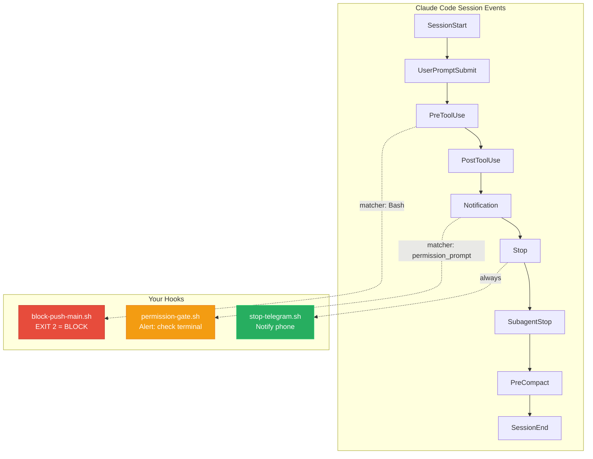
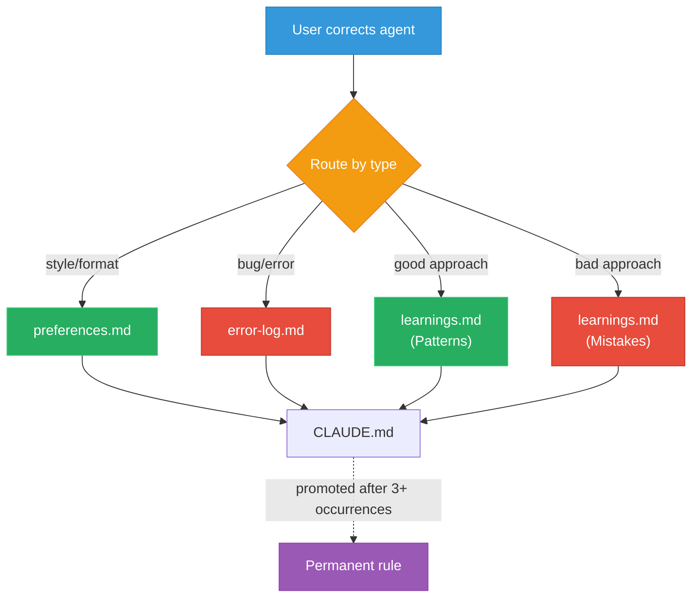
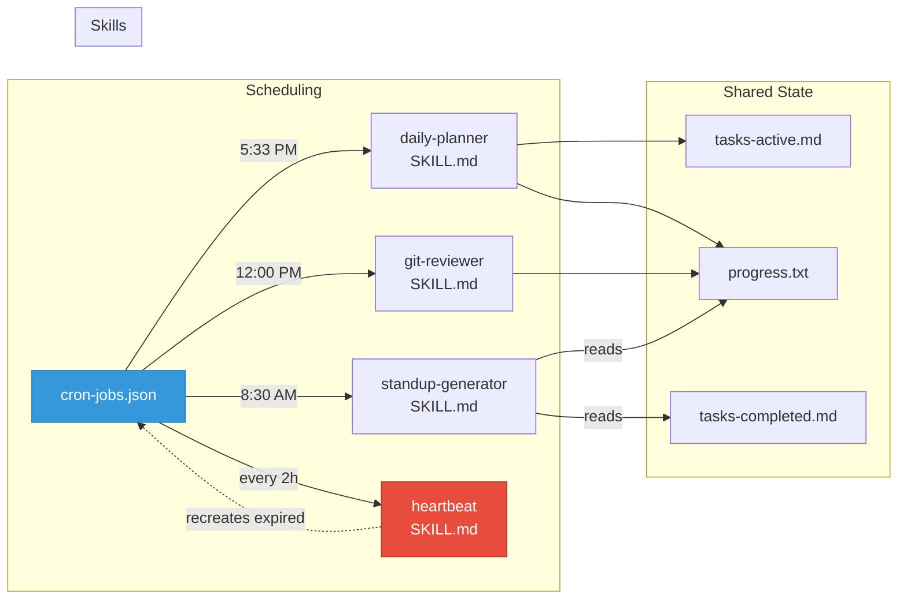
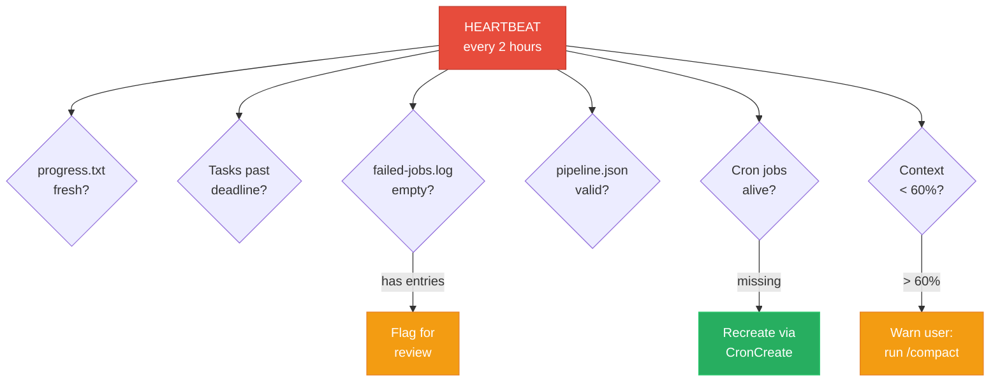

# Course Diagrams

## Mermaid Diagrams (embedded in lessons)
These render automatically on GitHub, Notion, and most blog platforms.
To convert to PNG: use https://mermaid.live or `mmdc` CLI.

## AI-Generated Images
Prompts for Gemini/DALL-E are in `../diagram-prompts.md`.
One image generated (autonomy loop) — available in Gemini chat history.

## Diagram 1: Autonomy Loop (Lesson 01)

## Diagram 2: Hooks and Events (Lesson 03)

## Diagram 3: Inline Learning Flow (Lesson 04)

## Diagram 4: Skills and Scheduling (Lesson 05)

## Diagram 5: Heartbeat Self-Healing (Lesson 09)

